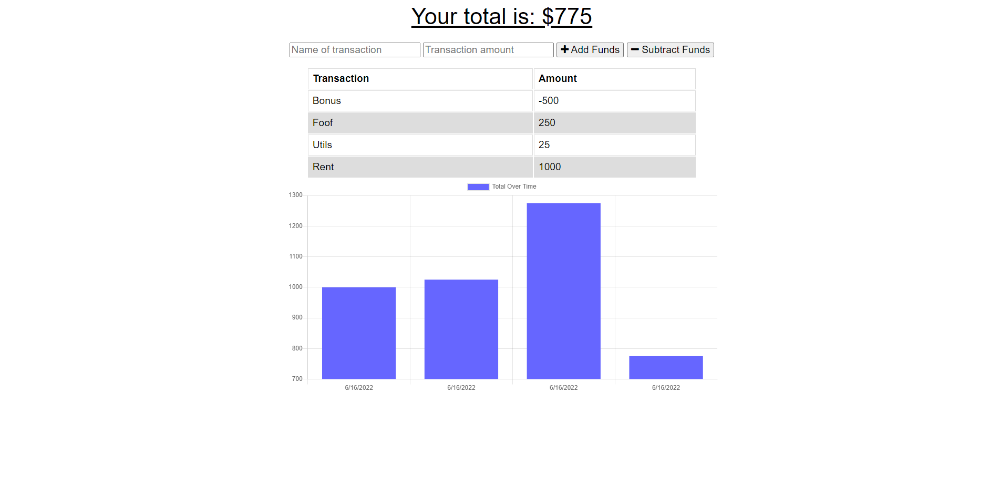
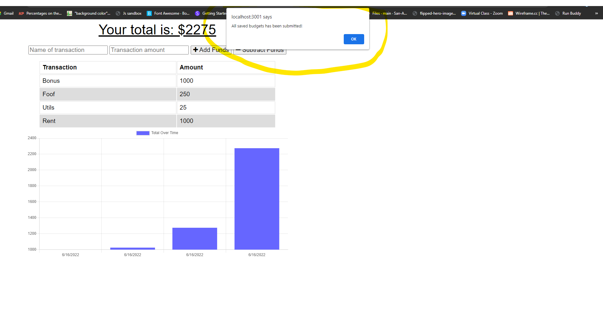
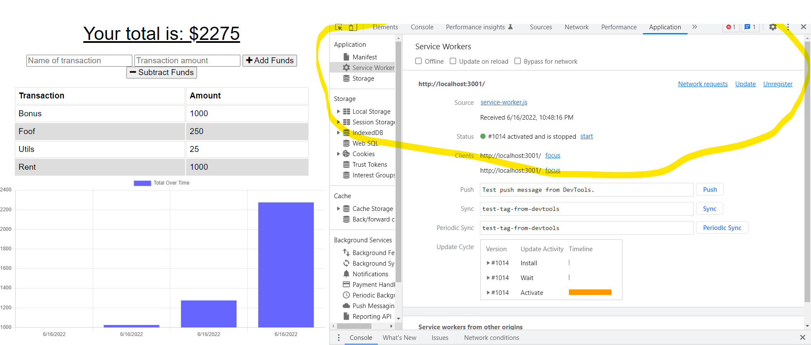

# license used:  MIT  

## Read about MIT license here:  'https://choosealicense.com/licenses/mit/'

      Copyright (c) 
Permission is hereby granted, free of charge, to any person obtaining a copy
of this software and associated documentation files (the "Software"), to deal
in the Software without restriction, including without limitation the rights
to use, copy, modify, merge, publish, distribute, sublicense, and/or sell
copies of the Software, and to permit persons to whom the Software is
furnished to do so, subject to the following conditions:

The above copyright notice and this permission notice shall be included in all
copies or substantial portions of the Software.

THE SOFTWARE IS PROVIDED "AS IS", WITHOUT WARRANTY OF ANY KIND, EXPRESS OR
IMPLIED, INCLUDING BUT NOT LIMITED TO THE WARRANTIES OF MERCHANTABILITY,
FITNESS FOR A PARTICULAR PURPOSE AND NONINFRINGEMENT. IN NO EVENT SHALL THE
AUTHORS OR COPYRIGHT HOLDERS BE LIABLE FOR ANY CLAIM, DAMAGES OR OTHER
LIABILITY, WHETHER IN AN ACTION OF CONTRACT, TORT OR OTHERWISE, ARISING FROM,
OUT OF OR IN CONNECTION WITH THE SOFTWARE OR THE USE OR OTHER DEALINGS IN THE
SOFTWARE

# Title: # Budget-Tracker

# Table of  Contents

* [Title](#title)
* [About](#about)
* [Built](#Technology)
* [Instalation](#header.instal)
* [Usage](header.usage)
* [License](#header.license)
* [Contribution](#header.contribution)

# About The Application:
  Using Progressive Web Application (PWA) this application enables the user to add expenses and deposits to their budget with or without an online connection. When entering transactions offline, data should populate the total when connected back online.

# Technology

**1. [JavaScript](https;//javascript.com/)**

**2. [Mongoose](https://Mongoose.com/)**: 

* Mongoose is an Object Data Modeling (ODM) library for MongoDB and Node. js. It manages relationships between data, provides schema validation, and is used to translate between objects in code and the representation of those objects in MongoD

**3. [Express.js](https://expressjs.com/)**:

* Web Applications : Express is a minimal and flexible Node.js web application framework that provides a robust set of features for web and   mobile applications.

* APIs : With a myriad of HTTP utility methods and middleware, creating a robust API is quick and easy.

* Performance : Express provides a thin layer of fundamental web application features, without obscuring Node.js features.

**4. [nodemon](https;//nodemon.com/)** :

* nodemon is a command-line interface (CLI) utility developed by @rem that wraps your Node app, watches the file system, and automatically restarts the process

**4. [Service worker](https;//Service-worker.com/)** :

* A Service worker sits between the browser and the network, acting like a proxy server, handling a collection of non- UI centric tasks. They are event driven and live outside the browser process, enabling them to work without an active browser session. The service worker is a script that executes in a thread, separate from the UI

**4. [IndexDB](https;//nodemon.com/)** :

* IndexedDB is a transactional database system, like an SQL-based RDBMS. However, unlike SQL-based RDBMSes, which use fixed-column tables, IndexedDB is a JavaScript-based object-oriented database. IndexedDB lets you store and retrieve objects that are indexed with a key; any objects supported by the structured clone algorithm can be stored.

  
# Instalation:

* Clone this repository to use this application on local machine, then npm i 

* To install necessary dependencies, run the following command :

  npm i express Mongoose and  npm i -D nodemon.

* npm run dev (to run the app with nodemon)  
  

* The application will be invoked with the following command: This will start localhost server on PORT 3001*.*

    node server.js

* Open browser and type http://localhost:3001/

# Features :

1. Used 'Express.js' to build server

2. Used mongoose to create a relation to database 

# Image snapshot with internet connection

# IndexDB

# Service Worker

# Contact:

* If you have any questions, feel free to [email](mailto:djigo.maouchi@yahoo.com)

# Contribution:
  This application is made by, Jugurta Maouchi